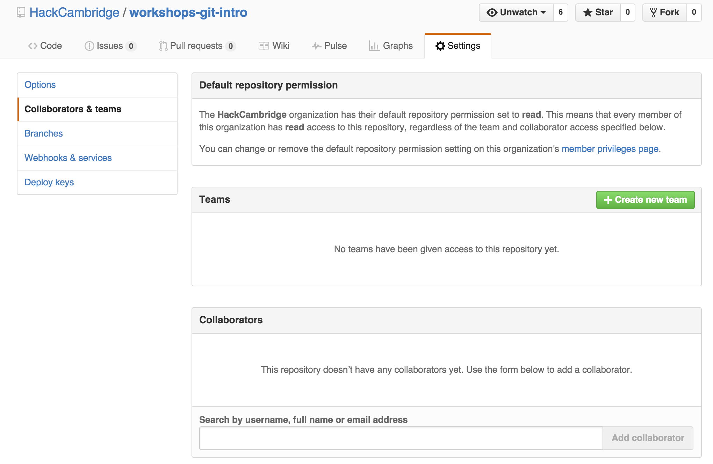

# Intro to Git
## What is Git and why should you use it?
Git is a version control system. It helps you organize projects in a way that lets you to:
- break your work up into manageable pieces
- modify the same files as several other people
- try multiple approaches without having to make backups
- reliably undo changes that don't work
- store your project remotely and transfer it to other machines
- *work on your project locally even without access to your remote copy*
and more! These features by themselves motivate the majority of programmers to use Git even
if they are working on a solo project. Moreover, larger teams simply would not be able
to function without version control.

Coming from no version control entirely, it may seem daunting to have to remember all of
these Git commands. The goal of this workshop is to give you a handful of commands that
will most of your day-to-day Git usage, and to show you some of the benefits along the way.

Let's begin.

## The Workshop
### Installing Git
- Windows: Download from https://git-scm.com/download/win
- OS X: Download from https://git-scm.com/download/mac OR
 install Homebrew http://brew.sh/ and run `$ brew install git` OR
 simply run `$ git` and you will be prompted to install Xcode Command Line Tools,
 which includes Git.
- Linux: `$ yum install git` on Fedora or `$ apt-get install git` on Debian-based distributions.

### Configuration
You need to introduce yourself to Git so that it can attribute code contributions to you. Run

`$ git config --global user.name "Your Name"`

and

`$ git config --global user.email your@email.com`

Doing this doesn't sign you up for anything and you won't get emails because of it.
It simply sets two variables in a global configuration file on your computer for later use.

### Making a Repository
Login at https://github.com/ and make a new repository with the button on the rightmost column.
Make sure to *check the box for initializing the repository with a README*.
Right now the repository only lives on GitHub's remote servers. To get it onto your local machine,
go to the directory you would like the project to be placed in and run
```
$ git clone <url of your github repository>
```
This will make a new directory that contains the project you have just cloned. Go into that directory
and run
```
$ git status
```
which should print
```
On branch master
Your branch is up-to-date with 'origin/master'.
nothing to commit, working directory clean
```
Congratulations, you've just created and cloned your first Git repository.

### Making Changes and Staging Files
Let's give Git some changes to track.
Using your favorite editor, write `Hello World` in line 3 of the README file.

If you run `$ git status` you will see something like
```
On branch master
Your branch is up-to-date with 'origin/master'.
Changes not staged for commit:
  (use "git add <file>..." to update what will be committed)
  (use "git checkout -- <file>..." to discard changes in working directory)

        modified:   README.md

no changes added to commit (use "git add" and/or "git commit -a")
```
Run
```
$ git add README.md
```
to stage the README file.

### Committing and Pushing
Once changes have been staged, we can commit them to the local repository with
```
$ git commit -m "Initial commit."
```
The `-m` flag signals that the string in double quotes following it is the *commit message*,
a short description of the changes in the commit.

Finally, to get your changes back onto GitHub, simply run
```
$ git push
```
You've made it through your first iteration of the edit-stage-commit-push cycle that is core to Git!

### Branching and Merging
Find somebody near you and introduce yourselves! We will now simulate collaborating on a project.
First, one person in each pair should add the other as a collaborator to the GitHub repository from earlier.

If you were the one added, make sure you clone that repository.

Next, each person should make a branch that is named with your own name in the shared repositories by using
```
$ git branch <your name>
```
That creates the branch, but if you run `$ git branch` you will find that you are still on the master branch.
To move to a different branch, run
```
$ git checkout <branch name>
```
In the future, this can be accomplished in one go with `$ git checkout -b <branch name>`, but it is important
to be aware of Git's branch management commands under `git branch`.

Once you've successfully moved to your new branch, write `contributors: <your name>` in the 4th line of the
README and then add-commit-push your changes to GitHub.

The owner of the repository should then pull the changes (partner, look over their shoulder while they do this)
```
$ git pull
```
You'll notice that your partner's branch have been pulled to your local repository. To finalize these changes,
first checkout your partner's branch. This is necessary because no reference for your partner's branch exists locally
until you check it out, even though the changes themselves have already been fetched to your local machine.
Then, checkout master and run
```
$ git merge <branch name>
```
for both you and your partner's branches.

The second time you merge, you will get a *merge conflict* since both you and your partner have edited the same line.
The areas where the two branches conflict are marked out like so:
```
<<<<<<< HEAD
contributors: foo
=======
contributors: bar
>>>>>>> bar
```
You will not be able to merge until all structures like this are resolved in the code. In this case, you're both
collaborators so resolve the merge conflict by listing both of your names in the collaborators lines.

Once you have finished resolving, add-commit-push again. If you were not the one doing the merging,
you should `$ git pull` to receive the changes in your local repository.

Feel free to spend some extra time making new branches, committing things, and merging back and forth!

### Finished!

You've worked through the exercises in this workshop. Try now to do some more complicated tasks, aided by the information
below. Our demonstrators will be on hand to answer any questions you have.

A good task will be to try and move some of your existing projects to Git and also GitHub.

## Best Practices
### Branching Structure
### Pull Requests
### Commit Messages
### What should I leave out of my repo?

You want your repo to be as system-agnostic as possible to allow anyone to clone it and do a bit of setup to start
running with the project. For this reason, you should leave out

- any files that are specific to your operating system,
- any files that pertain to a specific workspace or IDE (Java IDEs are very good at doing this)
- any sensitive information such as database passwords
- binary files (images are a common exception)
- anything that can be easily re-generated from your codebase (like binary files or packages from a package manager)

This may require some changes to your project if you have some of this information hard-coded with other files that
are important. This may be a time to look into general config files or environment variables to make your project
more comfortably work on other systems.

To make this more manageable, check out the `.gitignore` file below.

## Tips
### Adding lots of files

If you're writing a commit with lots of changes, you would spend far too much time adding all of these files manually.
Git commands support file "globbing", so instead of writing this:

```
git add assets/main.css
git add assets/normalize.css
git add assets/home.css
git add assets/video.css
```

You can write

```
git add assets/*.css
```

To add every `.css` file in the `assets` directory **that has been changed**. This extends
powerfully to the common statement

```
git add .
```

Which will add everything in your working directory that has been changed. What are the potential problems with this?

### The .gitignore file

When adding lots of files to git, there are files that for some reason or another, you will never want committed (see above). If
you try to remember these files manually, you will most likely forget. Why not let git know what files you don't want committed?

Simply create a `.gitignore` file at the root of your repository and list the files/folders you want to exclude

```
# Exclude any file with type .o
*.o

# Exclude a directory
annoying-ide-config/

# Exclude something only at the root
/config.json
/packages/
```

Now if we add a file `config.json`, and try `git add .`, nothing will be staged because Git knows to ignore that file.

The syntax can get quite complex and when it comes to *un-ignoring* something that has been ignored, can be slightly unintuitive.

### Your text editor/IDE

Git works happily with other software. There are a lot of nice GUIs that you can use if looking at your repo visually
will help. You may also find that your current editor of choice works with Git. The features can get quite fancy,
allowing you to make commits and add files right inside the editor. The key feature, though, is to have a text editor
that lets you easily see what files are changed. This will keep you much saner.

### Aliasing

## Further Reading/Useful Links

- [Slides used in the workshop](http://codepen.io/Pinpickle/full/wMYZGy/)
- [Official Git Docs](https://git-scm.com/documentation)
- [GitHub Flow](https://guides.github.com/introduction/flow/)
- [Interactive GitHub intro to Git](https://try.github.io/)
- [A tool for creating `.gitignore` files](https://www.gitignore.io/)
- [GitHub's GUI for Git](https://desktop.github.com/)
